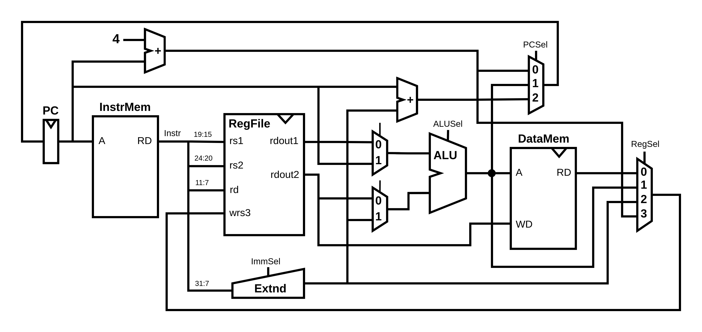
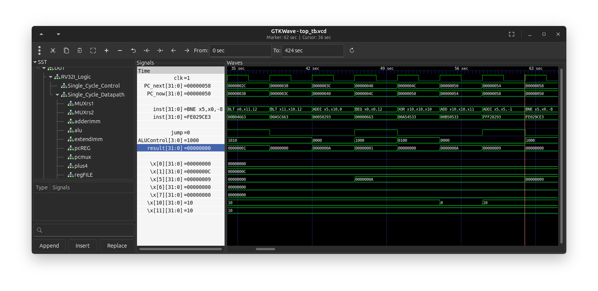

# RISC-V Single Cycle RV32I CPU

This project is an implementation of a Single Cycle CPU utilizing the RISC-V ISA. The design is based off of the RV32I implementation as outlined in the [RISC-V Instruction Set Manual](https://riscv.atlassian.net/wiki/spaces/HOME/pages/16154769/RISC-V+Technical+Specifications). Therefor making this a 32-bit cpu, written all in **Verilog**. This project was mostly made as a hobby and educational purposes.

## Architecture

This CPU is based off a Harvard architecture opting for separate instruction and data memory. For simplicity the image below just outlines the Datapath with no control logic.

## Requirements

- A general understanding of the RV32I implementation as referenced in the [RISC-V Instruction Set Manual](https://riscv.atlassian.net/wiki/spaces/HOME/pages/16154769/RISC-V+Technical+Specifications) may help with understanding of this project.
- A Verilog synthesis tool is needed for this project i used [Icarus Verilog](https://steveicarus.github.io/iverilog/).
- GTKWave or a waveform viewer of your choice (All my scripts are set up with GTKWave).
- 32 bit RISC-V Toolchain ([guide to build the toolchain](https://github.com/riscv/riscv-gnu-toolchain)) for more details on how to compile assembly or C refer to programs folder.

### Using GTKWave

GTKWave is a powerful free tool for viewing waveforms. It even allows for custom filters to be used with data for easier viewing. Below is an image of using a custom RV32I filter for displaying the hex as assembly. If this is of interest please check out the following [repo](https://github.com/PebPeb/riscv-32i-gtkwave) that I have built to help set that up.

